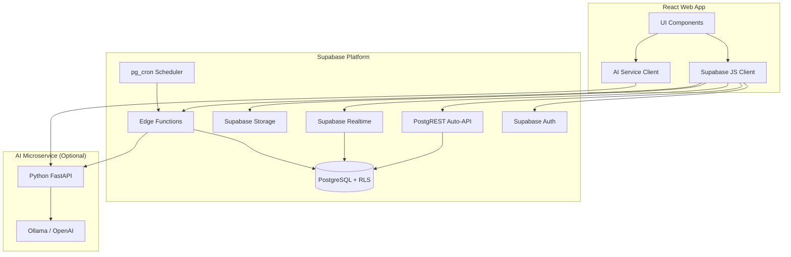
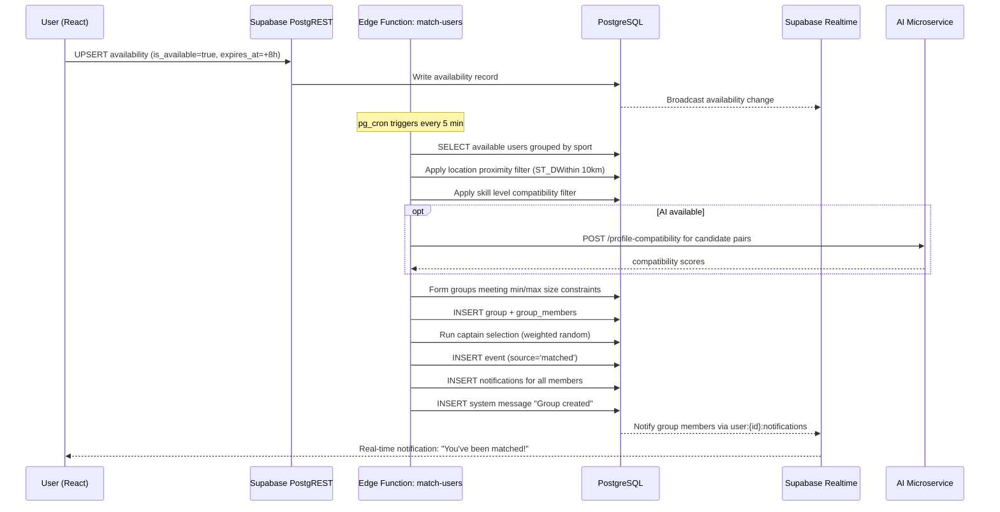
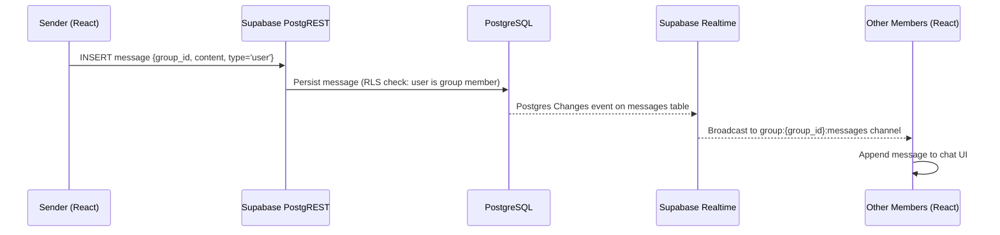
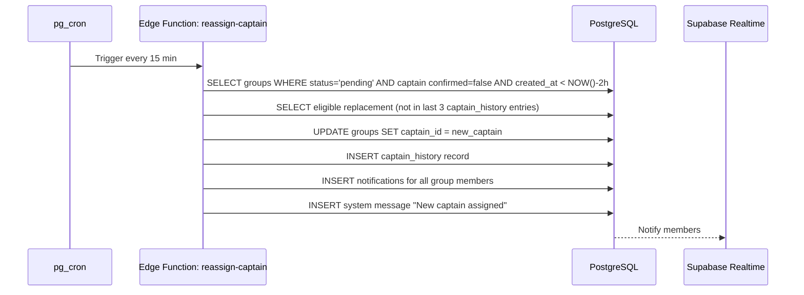
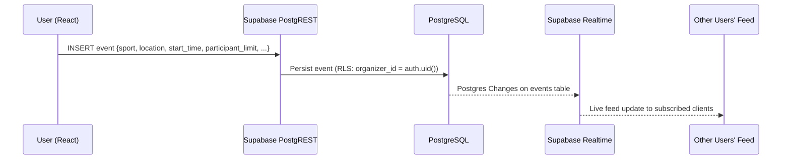

# Design Document — ShowUp2Move

## Overview

ShowUp2Move is a social sports-matching platform that lets users declare daily availability, get automatically grouped into sport-appropriate teams, coordinate logistics through real-time group chat, and show up to play. The architecture is built around **Supabase** as the primary backend platform, replacing the originally proposed Node.js/Express + Socket.IO + custom JWT stack with Supabase's managed services.

### Technology Stack

| Layer | Technology |
|---|---|
| Frontend | React (web app) |
| Auth | Supabase Auth (email/password + optional OAuth) |
| Database | PostgreSQL via Supabase |
| Real-time | Supabase Realtime (Postgres Changes + Broadcast) |
| File Storage | Supabase Storage |
| Business Logic | Supabase Edge Functions (Deno/TypeScript) |
| Scheduled Jobs | Supabase Edge Functions + pg_cron |
| AI Microservice | Python FastAPI (separate, optional) |
| Maps | Leaflet.js + OpenStreetMap (or Google Maps API) |

### Design Principles

1. **Supabase-first**: All persistence, auth, real-time, and storage go through Supabase. Edge Functions handle logic that cannot be expressed as PostgREST queries.
2. **AI is optional**: Every feature degrades gracefully when the AI microservice is unavailable.
3. **Row-Level Security everywhere**: All tables have RLS policies; the frontend can query Supabase directly for reads without a custom API layer.
4. **Minimal custom server code**: PostgREST auto-generates REST endpoints from the schema; Edge Functions are written only for logic that requires server-side orchestration (matching engine, captain selection, scheduled expiry).

---

## Architecture

### High-Level Architecture Diagram



### Request Flow Summary

- **Authentication**: Supabase Auth issues JWTs; the client attaches them to every request automatically via the Supabase JS SDK.
- **Data reads**: The React app calls PostgREST directly through the Supabase client. RLS policies enforce access control at the database level.
- **Data writes (simple)**: Direct PostgREST mutations (INSERT/UPDATE/DELETE) from the client, protected by RLS.
- **Data writes (complex)**: Edge Functions handle multi-step operations — matching engine, captain selection, group creation, venue polling.
- **Real-time**: Supabase Realtime subscriptions on `messages`, `notifications`, `groups`, and `events` tables deliver live updates to connected clients.
- **Scheduled jobs**: `pg_cron` triggers Edge Functions for availability expiry, re-engagement reminders, and captain inactivity checks.
- **File uploads**: Profile pictures go directly to Supabase Storage from the client; the public URL is stored in the `profiles` table.

---

## Components and Interfaces

### Component Map (Requirements → Supabase Primitives)

| Original Service | Supabase Replacement | Notes |
|---|---|---|
| Auth_Service | Supabase Auth | Email/password + optional Google OAuth |
| Profile_Service | PostgREST on `profiles` table + Storage | RLS ensures users edit only their own profile |
| Feed_Service | PostgREST on `events` view | Filtered queries with PostgREST query params |
| Availability_Service | PostgREST on `availability` table + pg_cron | Expiry handled by scheduled Edge Function |
| Matching_Engine | Edge Function `match-users` | Invoked by pg_cron or manually |
| Captain_Selector | Part of `match-users` Edge Function | Weighted random selection logic |
| Group_Service | PostgREST on `groups` + `group_members` | Membership changes trigger Realtime events |
| Chat_Service | Supabase Realtime Broadcast + `messages` table | Messages persisted to DB; Realtime for delivery |
| Event_Service | PostgREST on `events` table | RLS restricts organizer-only mutations |
| Notification_Service | `notifications` table + Realtime + Edge Functions | Scheduled notifications via pg_cron |
| Location_Service | PostGIS extension on PostgreSQL | `ST_DWithin` for proximity queries |
| AI_Service | External Python FastAPI | Called from Edge Functions; never from client |

### Edge Functions

| Function Name | Trigger | Responsibility |
|---|---|---|
| `match-users` | pg_cron (every 5 min) or HTTP POST | Run matching algorithm, create groups, assign captain, create chat room |
| `expire-availability` | pg_cron (every 1 min) | Mark expired availability records as inactive, remove from queues |
| `reassign-captain` | pg_cron (every 15 min) | Check for inactive captains (>2h), reassign |
| `send-reminders` | pg_cron (every hour) | Send pre-event reminders (1h before start) |
| `reengage-users` | pg_cron (daily) | Identify inactive users (≥5 days), trigger AI re-engagement messages |
| `ai-proxy` | HTTP POST from client | Proxy AI requests, handle timeouts, return degraded response on failure |
| `venue-suggestions` | HTTP POST from client | Call AI venue endpoint, return results or empty list on failure |

### Supabase Realtime Channels

| Channel | Type | Used For |
|---|---|---|
| `group:{group_id}:messages` | Broadcast + DB Changes | Live chat message delivery |
| `group:{group_id}:events` | DB Changes on `groups` | Member joins/leaves, status changes |
| `user:{user_id}:notifications` | DB Changes on `notifications` | Personal notification delivery |
| `feed` | DB Changes on `events` | Home feed live updates |
| `group:{group_id}:poll` | Broadcast | Live venue poll vote counts |

---

## Data Models

### Database Schema

#### `profiles`
```sql
CREATE TABLE profiles (
  id            UUID PRIMARY KEY REFERENCES auth.users(id) ON DELETE CASCADE,
  username      TEXT UNIQUE NOT NULL,
  display_name  TEXT NOT NULL,
  bio           TEXT CHECK (char_length(bio) <= 280),
  avatar_url    TEXT,
  location_lat  DOUBLE PRECISION,
  location_lng  DOUBLE PRECISION,
  location_city TEXT,
  created_at    TIMESTAMPTZ DEFAULT NOW(),
  updated_at    TIMESTAMPTZ DEFAULT NOW()
);
```

#### `user_sports`
```sql
CREATE TABLE user_sports (
  id          UUID PRIMARY KEY DEFAULT gen_random_uuid(),
  user_id     UUID NOT NULL REFERENCES profiles(id) ON DELETE CASCADE,
  sport       TEXT NOT NULL,  -- 'football' | 'basketball' | 'tennis' | 'volleyball' | ...
  skill_level TEXT CHECK (skill_level IN ('beginner', 'intermediate', 'advanced')),
  UNIQUE (user_id, sport)
);
```

#### `availability`
```sql
CREATE TABLE availability (
  id              UUID PRIMARY KEY DEFAULT gen_random_uuid(),
  user_id         UUID NOT NULL REFERENCES profiles(id) ON DELETE CASCADE,
  is_available    BOOLEAN NOT NULL DEFAULT TRUE,
  preferred_start TIMESTAMPTZ,
  preferred_end   TIMESTAMPTZ,
  expires_at      TIMESTAMPTZ NOT NULL,
  created_at      TIMESTAMPTZ DEFAULT NOW(),
  UNIQUE (user_id)  -- one active record per user
);
```

#### `availability_sports`
```sql
CREATE TABLE availability_sports (
  id              UUID PRIMARY KEY DEFAULT gen_random_uuid(),
  availability_id UUID NOT NULL REFERENCES availability(id) ON DELETE CASCADE,
  sport           TEXT NOT NULL
);
```

#### `groups`
```sql
CREATE TABLE groups (
  id           UUID PRIMARY KEY DEFAULT gen_random_uuid(),
  sport        TEXT NOT NULL,
  status       TEXT NOT NULL DEFAULT 'pending'
                 CHECK (status IN ('pending', 'confirmed', 'cancelled', 'completed')),
  captain_id   UUID REFERENCES profiles(id),
  min_size     INT NOT NULL,
  max_size     INT NOT NULL,
  created_at   TIMESTAMPTZ DEFAULT NOW(),
  confirmed_at TIMESTAMPTZ,
  event_id     UUID REFERENCES events(id)
);
```

#### `group_members`
```sql
CREATE TABLE group_members (
  id         UUID PRIMARY KEY DEFAULT gen_random_uuid(),
  group_id   UUID NOT NULL REFERENCES groups(id) ON DELETE CASCADE,
  user_id    UUID NOT NULL REFERENCES profiles(id) ON DELETE CASCADE,
  joined_at  TIMESTAMPTZ DEFAULT NOW(),
  confirmed  BOOLEAN DEFAULT FALSE,
  UNIQUE (group_id, user_id)
);
```

#### `captain_history`
```sql
CREATE TABLE captain_history (
  id         UUID PRIMARY KEY DEFAULT gen_random_uuid(),
  user_id    UUID NOT NULL REFERENCES profiles(id) ON DELETE CASCADE,
  group_id   UUID NOT NULL REFERENCES groups(id) ON DELETE CASCADE,
  assigned_at TIMESTAMPTZ DEFAULT NOW()
);
```

#### `events`
```sql
CREATE TABLE events (
  id                UUID PRIMARY KEY DEFAULT gen_random_uuid(),
  sport             TEXT NOT NULL,
  title             TEXT,
  description       TEXT CHECK (char_length(description) <= 500),
  organizer_id      UUID NOT NULL REFERENCES profiles(id),
  group_id          UUID REFERENCES groups(id),
  location_name     TEXT,
  location_lat      DOUBLE PRECISION,
  location_lng      DOUBLE PRECISION,
  start_time        TIMESTAMPTZ NOT NULL,
  participant_limit INT NOT NULL,
  skill_requirement TEXT CHECK (skill_requirement IN ('beginner', 'intermediate', 'advanced')),
  price_per_person  NUMERIC(10,2),
  status            TEXT NOT NULL DEFAULT 'open'
                      CHECK (status IN ('open', 'full', 'confirmed', 'cancelled', 'completed')),
  source            TEXT NOT NULL DEFAULT 'manual'
                      CHECK (source IN ('manual', 'matched')),
  created_at        TIMESTAMPTZ DEFAULT NOW()
);
```

#### `event_participants`
```sql
CREATE TABLE event_participants (
  id         UUID PRIMARY KEY DEFAULT gen_random_uuid(),
  event_id   UUID NOT NULL REFERENCES events(id) ON DELETE CASCADE,
  user_id    UUID NOT NULL REFERENCES profiles(id) ON DELETE CASCADE,
  status     TEXT NOT NULL DEFAULT 'joined'
               CHECK (status IN ('joined', 'confirmed', 'cancelled')),
  joined_at  TIMESTAMPTZ DEFAULT NOW(),
  UNIQUE (event_id, user_id)
);
```

#### `messages`
```sql
CREATE TABLE messages (
  id         UUID PRIMARY KEY DEFAULT gen_random_uuid(),
  group_id   UUID NOT NULL REFERENCES groups(id) ON DELETE CASCADE,
  sender_id  UUID REFERENCES profiles(id),  -- NULL for system messages
  content    TEXT NOT NULL,
  type       TEXT NOT NULL DEFAULT 'user'
               CHECK (type IN ('user', 'system')),
  reactions  JSONB DEFAULT '{}',  -- { "👍": ["user_id1", ...], ... }
  created_at TIMESTAMPTZ DEFAULT NOW()
);
```

#### `notifications`
```sql
CREATE TABLE notifications (
  id         UUID PRIMARY KEY DEFAULT gen_random_uuid(),
  user_id    UUID NOT NULL REFERENCES profiles(id) ON DELETE CASCADE,
  type       TEXT NOT NULL,  -- 'match_found' | 'captain_assigned' | 'event_confirmed' | ...
  title      TEXT NOT NULL,
  body       TEXT NOT NULL,
  data       JSONB DEFAULT '{}',  -- arbitrary payload (group_id, event_id, etc.)
  read       BOOLEAN DEFAULT FALSE,
  created_at TIMESTAMPTZ DEFAULT NOW()
);
```

#### `venue_polls`
```sql
CREATE TABLE venue_polls (
  id         UUID PRIMARY KEY DEFAULT gen_random_uuid(),
  group_id   UUID NOT NULL REFERENCES groups(id) ON DELETE CASCADE,
  created_by UUID NOT NULL REFERENCES profiles(id),
  status     TEXT NOT NULL DEFAULT 'open' CHECK (status IN ('open', 'closed')),
  created_at TIMESTAMPTZ DEFAULT NOW()
);
```

#### `venue_poll_options`
```sql
CREATE TABLE venue_poll_options (
  id           UUID PRIMARY KEY DEFAULT gen_random_uuid(),
  poll_id      UUID NOT NULL REFERENCES venue_polls(id) ON DELETE CASCADE,
  venue_name   TEXT NOT NULL,
  price_est    NUMERIC(10,2),
  distance_km  DOUBLE PRECISION,
  votes        INT DEFAULT 0
);
```

#### `venue_poll_votes`
```sql
CREATE TABLE venue_poll_votes (
  id        UUID PRIMARY KEY DEFAULT gen_random_uuid(),
  poll_id   UUID NOT NULL REFERENCES venue_polls(id) ON DELETE CASCADE,
  option_id UUID NOT NULL REFERENCES venue_poll_options(id) ON DELETE CASCADE,
  user_id   UUID NOT NULL REFERENCES profiles(id) ON DELETE CASCADE,
  UNIQUE (poll_id, user_id)  -- one vote per user per poll
);
```

#### `matching_queue`
```sql
CREATE TABLE matching_queue (
  id         UUID PRIMARY KEY DEFAULT gen_random_uuid(),
  user_id    UUID NOT NULL REFERENCES profiles(id) ON DELETE CASCADE,
  sport      TEXT NOT NULL,
  queued_at  TIMESTAMPTZ DEFAULT NOW(),
  UNIQUE (user_id, sport)
);
```

### Sport Size Constants (enforced in Edge Function logic)

```typescript
const SPORT_SIZES: Record<string, { min: number; max: number }> = {
  football:   { min: 10, max: 14 },
  basketball: { min: 6,  max: 10 },
  tennis:     { min: 2,  max: 4  },
  volleyball: { min: 8,  max: 12 },
};
```

### Row-Level Security Policies

```sql
-- profiles: users can read all profiles, edit only their own
ALTER TABLE profiles ENABLE ROW LEVEL SECURITY;
CREATE POLICY "profiles_select_all"  ON profiles FOR SELECT USING (true);
CREATE POLICY "profiles_update_own"  ON profiles FOR UPDATE USING (auth.uid() = id);

-- availability: users manage only their own
ALTER TABLE availability ENABLE ROW LEVEL SECURITY;
CREATE POLICY "avail_select_own"  ON availability FOR SELECT USING (auth.uid() = user_id);
CREATE POLICY "avail_insert_own"  ON availability FOR INSERT WITH CHECK (auth.uid() = user_id);
CREATE POLICY "avail_update_own"  ON availability FOR UPDATE USING (auth.uid() = user_id);

-- groups: members can read their groups
ALTER TABLE groups ENABLE ROW LEVEL SECURITY;
CREATE POLICY "groups_select_member" ON groups FOR SELECT
  USING (id IN (SELECT group_id FROM group_members WHERE user_id = auth.uid()));

-- messages: group members can read and insert
ALTER TABLE messages ENABLE ROW LEVEL SECURITY;
CREATE POLICY "messages_select_member" ON messages FOR SELECT
  USING (group_id IN (SELECT group_id FROM group_members WHERE user_id = auth.uid()));
CREATE POLICY "messages_insert_member" ON messages FOR INSERT
  WITH CHECK (group_id IN (SELECT group_id FROM group_members WHERE user_id = auth.uid())
              AND (sender_id = auth.uid() OR sender_id IS NULL));

-- notifications: users see only their own
ALTER TABLE notifications ENABLE ROW LEVEL SECURITY;
CREATE POLICY "notif_select_own" ON notifications FOR SELECT USING (auth.uid() = user_id);
CREATE POLICY "notif_update_own" ON notifications FOR UPDATE USING (auth.uid() = user_id);

-- events: all authenticated users can read open events
ALTER TABLE events ENABLE ROW LEVEL SECURITY;
CREATE POLICY "events_select_auth" ON events FOR SELECT USING (auth.role() = 'authenticated');
CREATE POLICY "events_insert_own"  ON events FOR INSERT WITH CHECK (auth.uid() = organizer_id);
CREATE POLICY "events_update_own"  ON events FOR UPDATE
  USING (auth.uid() = organizer_id
         OR auth.uid() IN (SELECT captain_id FROM groups WHERE id = group_id));
```

### Supabase Storage Buckets

| Bucket | Access | Purpose |
|---|---|---|
| `avatars` | Public read, authenticated write | Profile pictures |

Storage policy: users may only upload to `avatars/{user_id}/*`.

---

## Data Flow Diagrams

### Flow 1: Availability → Matching → Group Creation → Chat



### Flow 2: Group Chat Message



### Flow 3: Captain Inactivity Reassignment



### Flow 4: Manual Event Creation → Feed



---

## Correctness Properties

*A property is a characteristic or behavior that should hold true across all valid executions of a system — essentially, a formal statement about what the system should do. Properties serve as the bridge between human-readable specifications and machine-verifiable correctness guarantees.*

### Property 1: Availability expiry invariant

*For any* availability declaration created at time T, the `expires_at` timestamp SHALL equal T + 8 hours (ensuring no record is born already expired), AND for any user whose `expires_at` has passed, that user SHALL NOT appear as available in any matching engine run and SHALL be removed from `matching_queue` if present.

**Validates: Requirements 6.1, 6.4, 16.5**

---

### Property 2: Matching group size bounds and completeness

*For any* run of the matching engine, every group that is created SHALL have a member count that satisfies `min_size(sport) ≤ members ≤ max_size(sport)`. Furthermore, if the number of available users for a sport is strictly less than `min_size(sport)`, no group SHALL be created for that sport and all candidate users SHALL be placed in the pending queue.

**Validates: Requirements 7.1, 7.2, 7.6**

---

### Property 3: Captain selection invariant

*For any* group created by the matching engine, exactly one captain SHALL be assigned, the captain SHALL be a current member of that group, and users who appear in the last 3 entries of `captain_history` for that user SHALL have a strictly lower selection probability than users with no recent captain history.

**Validates: Requirements 8.1, 8.2**

---

### Property 4: Password security invariant

*For any* user registration with any password string, the value stored in the database SHALL be a valid bcrypt hash (not the plaintext password), AND no API response for any user operation SHALL contain a password or password hash field.

**Validates: Requirements 1.3, 1.4**

---

### Property 5: Feed filter correctness

*For any* combination of sport filter, distance filter, and time filter applied to the home feed, every event returned SHALL satisfy all active filter conditions simultaneously — matching the specified sport type, falling within the specified radius of the user's location, and starting within the specified time window.

**Validates: Requirements 5.2, 5.3, 5.4**

---

### Property 6: Message sender membership invariant

*For any* message inserted into a group's chat room, the sender SHALL be a current member of that group (enforced by RLS). Any attempt to insert a message by a user who is not a group member SHALL be rejected with a permission error.

**Validates: Requirements 9.2**

---

### Property 7: Venue poll vote uniqueness

*For any* venue poll, each user SHALL have at most one vote recorded across all options in that poll. Any attempt to cast a second vote from the same user in the same poll SHALL either be rejected or atomically replace the previous vote, ensuring the total vote count per user never exceeds one.

**Validates: Requirements 11.3, 11.4**

---

### Property 8: Event participant limit invariant

*For any* event with a defined `participant_limit` N, the count of active (non-cancelled) participants in `event_participants` SHALL never exceed N. Any join attempt when the active participant count equals N SHALL be rejected and the event SHALL be marked as full.

**Validates: Requirements 10.5**

---

### Property 9: Re-engagement notification rate limiting

*For any* user, the system SHALL send at most one re-engagement reminder within any rolling 48-hour window. Additionally, for any user who declares availability after receiving a re-engagement reminder, no further re-engagement reminder SHALL be sent for the following 7 days.

**Validates: Requirements 15.4, 15.5**

---

### Property 10: AI degradation does not block core operations

*For any* request to a core feature (profile creation, availability declaration, matching, group chat, event creation, notifications) while the AI service is marked unavailable, the operation SHALL complete successfully and return a valid non-error response. The absence of AI SHALL result in degraded suggestions (empty lists, generic messages) but SHALL NOT prevent the user from completing their task.

**Validates: Requirements 14.3, 4.2, 7.5, 11.2**

---

### Property 11: Group membership change consistency

*For any* group with N active members, when one member leaves, the resulting active member count SHALL equal N − 1, a system message SHALL be posted in the group chat, and if N − 1 is less than `min_size(sport)`, all remaining members SHALL receive a notification offering re-queue or cancellation options.

**Validates: Requirements 16.2, 16.3**

---

### Property 12: Profile data round-trip

*For any* valid profile update (display name + at least one sport), saving the profile and then retrieving it SHALL return a record containing all submitted fields with their values unchanged, and the user's manually selected sports SHALL remain unmodified by any subsequent AI suggestion call that has not received explicit user confirmation.

**Validates: Requirements 3.1, 3.4**

---

## Error Handling

### Authentication Errors

| Scenario | Behavior |
|---|---|
| Duplicate email on registration | Supabase Auth returns 422; frontend shows "Email already in use" |
| Invalid credentials on login | Supabase Auth returns 400; frontend shows "Email or password is incorrect" (no field disambiguation) |
| Expired/invalid JWT | Supabase returns 401; frontend redirects to login with descriptive message |
| Accessing protected route unauthenticated | Frontend intercepts and redirects with context message (e.g., "Log in to join activities") |

### Matching Engine Errors

| Scenario | Behavior |
|---|---|
| Insufficient users for a sport | No group created; users remain in queue; notification sent: "Matching in progress" |
| Group falls below minimum after member leaves | Group_Service notifies remaining members; offers re-queue or cancel |
| Captain inactive for 2 hours | `reassign-captain` Edge Function promotes next eligible member |

### AI Service Errors

| Scenario | Behavior |
|---|---|
| `/health` returns non-200 or times out (3s) | Backend marks AI unavailable; all AI features enter degraded mode |
| `/extract-interests` fails | Returns `{ sports: [], error: "service unavailable" }`; user selects sports manually |
| `/profile-compatibility` fails | Matching proceeds without compatibility scores |
| `/venue-recommendations` fails | Returns empty venue list; captain informed via non-blocking UI message |
| AI recovers | Backend automatically resumes AI features on next health check |

### Real-Time Errors

| Scenario | Behavior |
|---|---|
| Realtime connection drops | Supabase JS SDK auto-reconnects; UI shows subtle "Reconnecting..." indicator |
| Message delivery failure | Message is persisted in DB; client re-fetches last 50 messages on reconnect |

### General API Errors

| Scenario | Behavior |
|---|---|
| Unexpected 5xx from Supabase | Frontend displays descriptive error with retry button; never blank screen |
| Network timeout | Frontend shows "Connection issue — tap to retry" |
| RLS policy violation (403) | Frontend shows "You don't have permission to do that" |

---

## Testing Strategy

### Dual Testing Approach

The testing strategy combines **unit/example-based tests** for specific behaviors and **property-based tests** for universal correctness guarantees.

### Property-Based Testing

Property-based testing (PBT) is applicable to this feature because the matching engine, availability system, captain selection, and notification rate-limiting all involve pure logic functions with large input spaces where input variation reveals edge cases.

**PBT Library**: [fast-check](https://github.com/dubzzz/fast-check) (TypeScript, runs in Deno for Edge Functions and in Vitest for frontend logic)

**Configuration**: Minimum 100 iterations per property test.

**Tag format**: `// Feature: show-up-2-move, Property {N}: {property_text}`

Each correctness property from the design document maps to exactly one property-based test:

| Property | Test File | fast-check Arbitraries |
|---|---|---|
| P1: Availability expiry invariant | `availability.test.ts` | `fc.date()` for creation time; `fc.date({max: pastDate})` for expired records |
| P2: Matching group size bounds | `matching-engine.test.ts` | `fc.array(fc.record({sport, skill, location}), {minLength: 0, maxLength: 30})` |
| P3: Captain selection invariant | `captain-selector.test.ts` | `fc.array(fc.uuid(), {minLength:2})` for members + `fc.array` for captain history |
| P4: Password security invariant | `auth.test.ts` | `fc.string({minLength:8})` for passwords |
| P5: Feed filter correctness | `feed-service.test.ts` | `fc.record({sport, lat, lng, radius, timeWindow})` + random event sets |
| P6: Message sender membership | `chat-rls.test.ts` | `fc.uuid()` for sender/group combinations |
| P7: Venue poll vote uniqueness | `venue-poll.test.ts` | `fc.array(fc.record({userId, optionId}))` with potential duplicates |
| P8: Event participant limit | `event-service.test.ts` | `fc.integer({min:1, max:50})` for limit + `fc.integer` for join attempts |
| P9: Re-engagement rate limiting | `notification-service.test.ts` | `fc.array(fc.date())` for activity timestamp sequences |
| P10: AI degradation | `ai-degradation.test.ts` | `fc.boolean()` for AI availability flag + `fc.oneof` for operation types |
| P11: Group membership consistency | `group-service.test.ts` | `fc.integer({min:2, max:20})` for group size + sport type |
| P12: Profile data round-trip | `profile-service.test.ts` | `fc.record({displayName, sports: fc.array(fc.string())})` |

### Unit / Example-Based Tests

- **Auth flows**: Registration with duplicate email, login with wrong password, JWT expiry handling
- **Feed filtering**: Sport filter, distance filter, time filter, empty state
- **Profile CRUD**: Bio length validation, avatar URL storage, sport preference update
- **Chat**: Last 50 messages retrieval, system message insertion on join/leave
- **Event creation**: Required fields validation, organizer assignment, feed appearance within 10s
- **Captain reassignment**: 2-hour inactivity trigger, notification delivery

### Integration Tests

- **Supabase RLS**: Verify that users cannot read/write other users' availability, notifications, or group messages
- **Realtime subscriptions**: Verify that inserting a message triggers the correct channel broadcast
- **Edge Function end-to-end**: Run `match-users` against a seeded test database and verify group creation

### Testing Tools

| Tool | Purpose |
|---|---|
| Vitest | Unit and property tests for frontend logic and Edge Function utilities |
| fast-check | Property-based test generation |
| Supabase local dev (`supabase start`) | Integration tests against local Postgres + Edge Functions |
| Playwright | E2E tests for critical user flows (register → availability → match → chat) |
